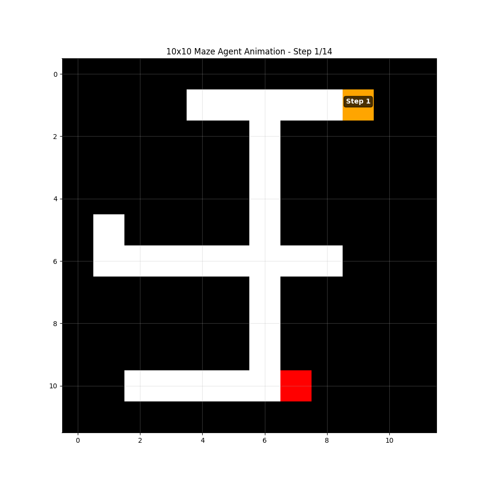
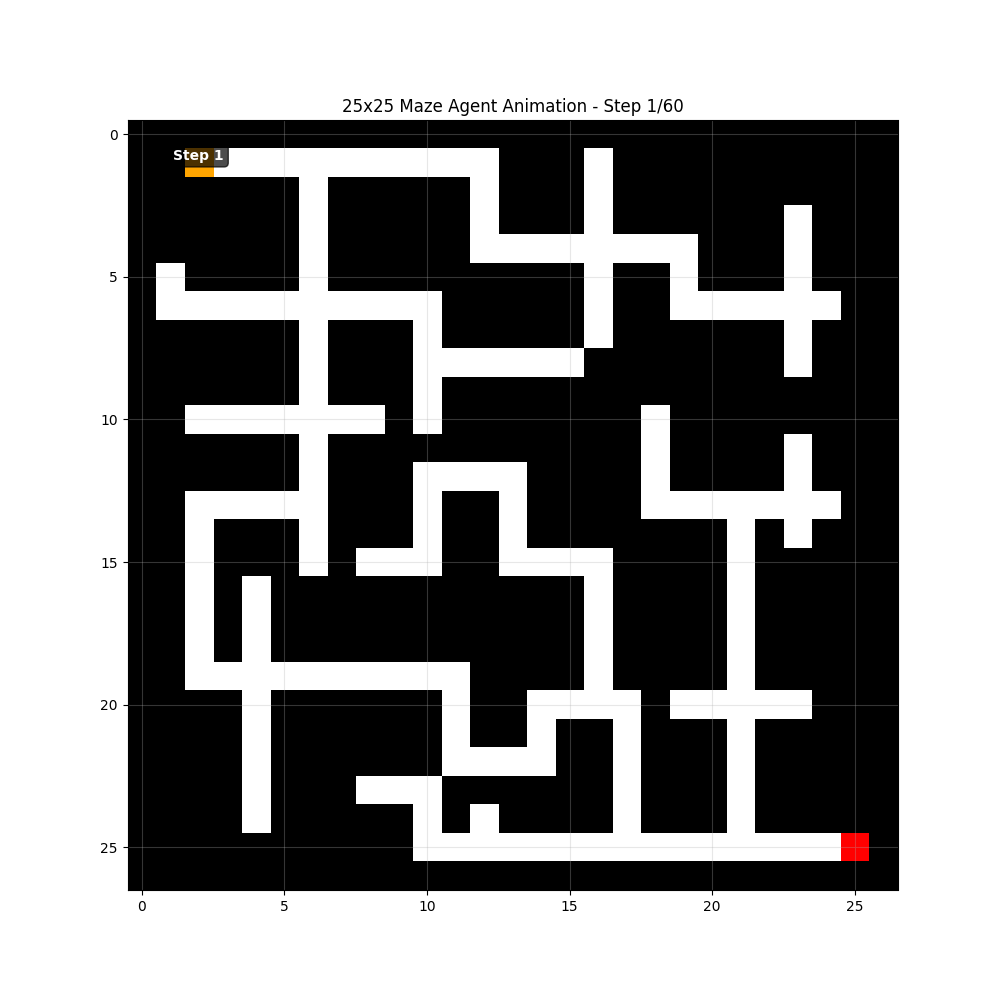
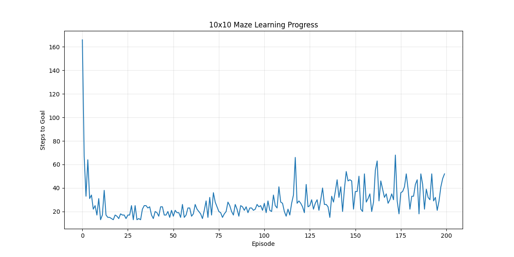
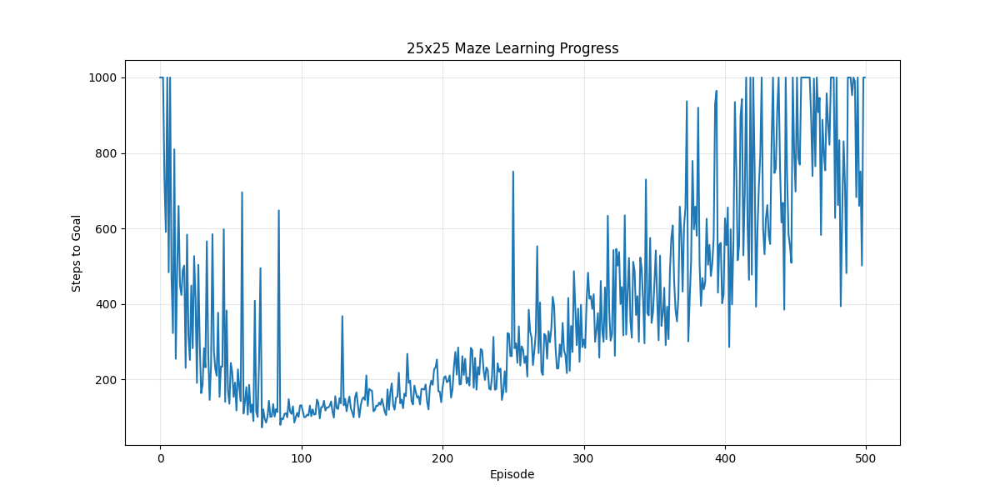
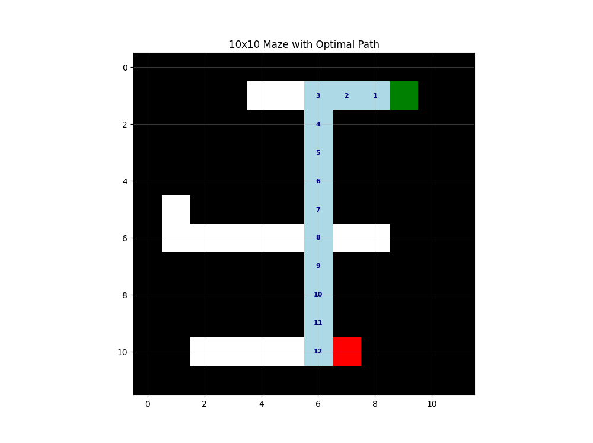
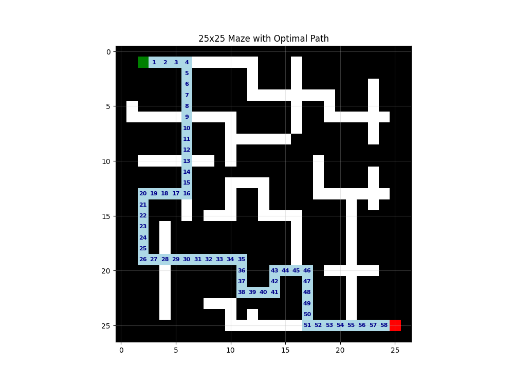

# Q-Learning 迷宮求解器

這個專案使用 Q-Learning 強化學習演算法來解決兩個不同大小的迷宮問題。

## 迷宮編碼

- `0`: 可通行路徑 (白色)
- `1`: 牆壁 (黑色)  
- `2`: 起始位置 (綠色)
- `3`: 目標位置 (紅色)

### 自定義參數

```python
from q_learning_maze import solve_maze_qlearning

# 自定義訓練參數
agent, steps_history = solve_maze_qlearning(
    maze=your_maze,
    episodes=300,      # 訓練回合數
    lr=0.7,           # 學習率
    gamma=0.9,        # 折扣因子
    epsilon=0.9,      # 探索率
    epsilon_decay=0.995  # 探索率衰減
)
```

## Q-Learning 核心概念

### 1. Q-Table 更新公式

```
Q(s,a) = (1-α) × Q(s,a) + α × [r + γ × max(Q(s',a'))]
```

其中:
- `α` (lr): 學習率，控制新信息的接受程度
- `γ` (gamma): 折扣因子，控制未來獎勵的重要性
- `r`: 即時獎勵
- `s,a`: 當前狀態和動作
- `s'`: 下一個狀態

### 2. 獎勵機制

- **到達目標**: +100 分
- **正常移動**: -1 分  
- **撞牆/邊界**: -10 分

### 3. ε-greedy 策略

- 以 ε 的機率選擇最優動作 (exploitation)
- 以 (1-ε) 的機率隨機探索 (exploration)
- ε 值隨訓練進行而衰減

## 類別說明

### Environment
處理迷宮環境互動，包括:
- 狀態轉換邏輯
- 獎勵計算
- 邊界檢查

### Agent  
Q-Learning 代理人，包括:
- Q-Table 初始化和更新
- 動作選擇策略
- 學習參數管理

### MazeVisualizer
視覺化工具，提供:
- 迷宮地圖顯示
- 學習曲線繪製
- 最優路徑標記

## 訓練結果

程式會輸出以下信息:
- 每10個回合的訓練進度
- 最終最優路徑長度
- 平均收斂步數
- 學習曲線圖表

### 10x10 迷宮訓練過程


### 25x25 迷宮訓練過程


### 學習曲線



### 路徑探索分析


